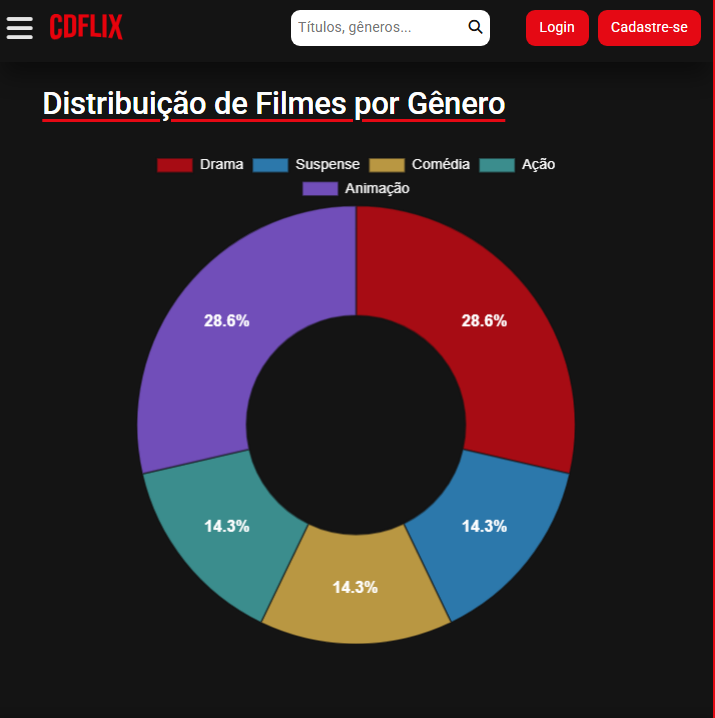
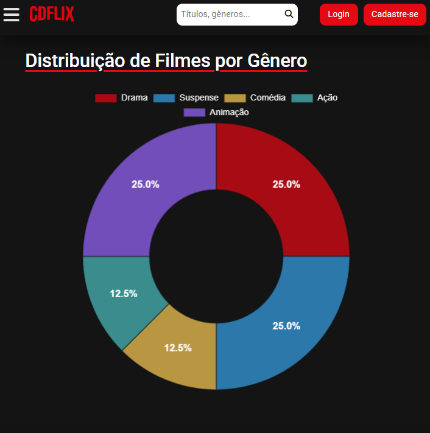

# Trabalho Prático - Semana 14

A partir dos dados cadastrados na etapa anterior, vamos trabalhar formas de apresentação que representem de forma clara e interativa as informações do seu projeto. Você poderá usar gráficos (barra, linha, pizza), mapas, calendários ou outras formas de visualização. Seu desafio é entregar uma página Web que organize, processe e exiba os dados de forma compreensível e esteticamente agradável.

Com base nos tipos de projetos escohidos, você deve propor **visualizações que estimulem a interpretação, agrupamento e exibição criativa dos dados**, trabalhando tanto a lógica quanto o design da aplicação.

Sugerimos o uso das seguintes ferramentas acessíveis: [FullCalendar](https://fullcalendar.io/), [Chart.js](https://www.chartjs.org/), [Mapbox](https://docs.mapbox.com/api/), para citar algumas.

## Informações do trabalho

- Nome:
- Matricula:
- Proposta de projeto escolhida:
- Breve descrição sobre seu projeto:

**Print da tela com a implementação**

### Implementação da Visualização de Dados com Gráficos

Nesta etapa, o projeto foi expandido com a implementação de uma página de visualização de dados dinâmica, com o objetivo de apresentar uma análise sobre o catálogo de filmes cadastrados.

Para esta funcionalidade, optou-se pela biblioteca **`Chart.js`**, uma ferramenta de código aberto que permite a criação de gráficos interativos sem a necessidade de chaves de API ou cadastros. A fim de possibilitar a análise desejada, a base de dados (`db.json`) foi primeiramente enriquecida, com a adição de um campo `gênero` em cada registro de filme.

A implementação consistiu na criação da página `graficos.html` para abrigar a visualização, que é controlada pelo script `assets/scripts/graficos.js`. Este script é responsável por:

1.  Buscar os dados dos filmes de forma assíncrona a partir do `db.json`.
2.  Processar os dados para contabilizar o número de filmes por gênero.
3.  Renderizar dinamicamente um gráfico do tipo **rosca ("doughnut chart")**.

O gráfico final exibe a distribuição de gêneros de forma percentual diretamente nas fatias (utilizando o plugin **`chartjs-plugin-datalabels`**), possui legendas e dicas de ferramenta personalizadas para uma melhor experiência do usuário, e é totalmente interativo.

